# SDN-Based Firewall using Ryu Controller

## 1. Problem Statement

This project implements an SDN-based firewall using Mininet and a Ryu controller.  
The goal is to control network traffic dynamically using OpenFlow rules by allowing or blocking communication between hosts.

Key objectives:

- Demonstrate controller–switch interaction
- Implement match–action flow rules
- Block traffic between specific hosts (firewall behavior)
- Maintain normal forwarding using a learning switch

---

## 2. Setup & Execution Steps

### Prerequisites

- Python 3
- Mininet
- Ryu Controller
- Open vSwitch

### Steps to Run

1. Clone the repository

```bash
git clone https://github.com/winterwidow/sdn-project
cd sdn-project
```

2. Start the Ryu controller in virtual environment

```bash
ryu-manager firewall_controller.py
```

3. Run Mininet topology

```bash
sudo mn --topo single,3 --controller remote --switch ovsk,protocols=OpenFlow13
```

4. Verify connectivity

```bash
pingall
```

5. Test firewall behavior

Allowed traffic:

```bash
h2 ping h3
```

Blocked traffic:

```bash
h1 ping h2
```

6. Run throughput test (iperf)

```bash
iperf h1 h3
iperf h2 h3
```

---

## 3. Expected Output

- Normal communication between allowed hosts
- Blocked communication for restricted host pair (10.0.0.1→ 10.0.0.2)
- Controller logs showing:
  - Packet-in events
  - BLOCKED messages
- Flow table entries:
  - Forwarding rules (priority 1)
  - Drop rules (priority 100)

---

## 4. Proof of Execution

### Flow Table

```bash
sudo ovs-ofctl dump-flows s1
```

### Validation

- Ping:
  - Success → allowed traffic
  - Failure → blocked traffic

- iperf:
  - Throughput observed for allowed traffic
  - No throughput for blocked traffic

---

## 5. Screenshots

### Cnotroller Stratup

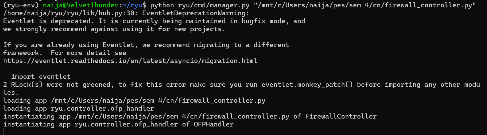

### Mininet Topology

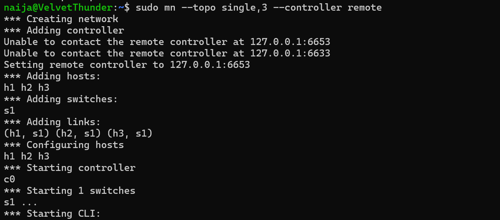

### Blocked ping

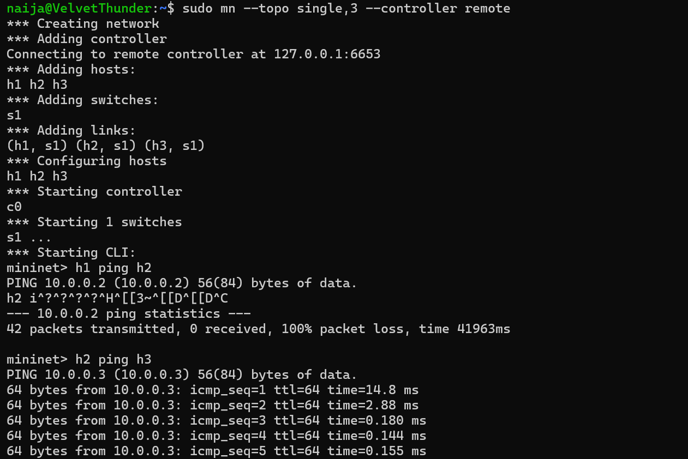
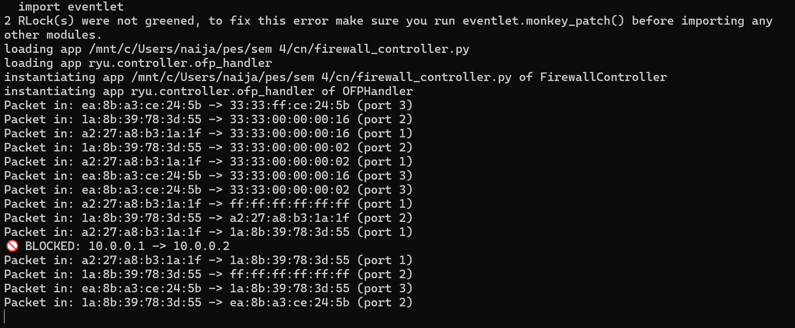

### Allowed ping

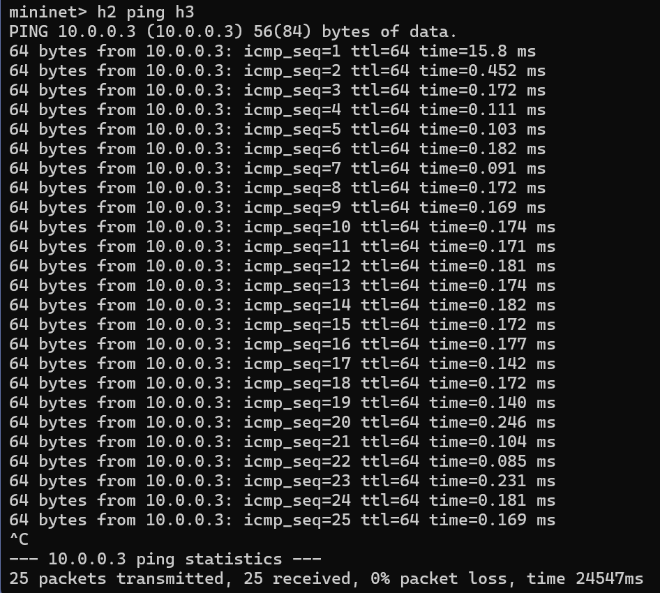
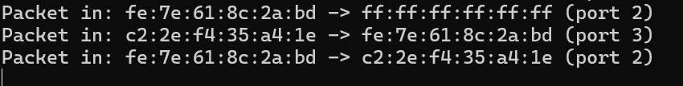

### Controller logs

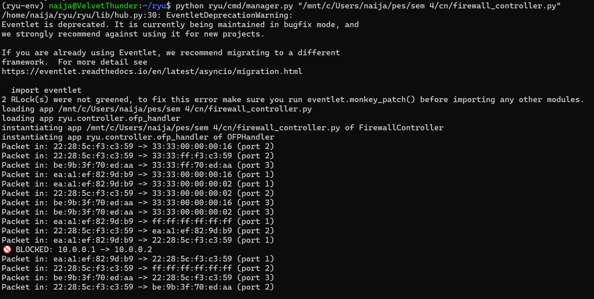

### Flow table

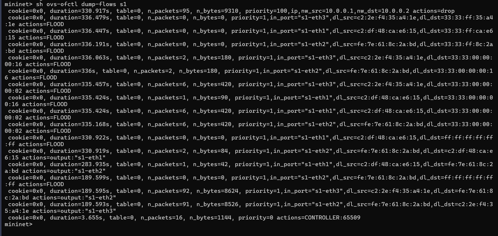

### Latency ping

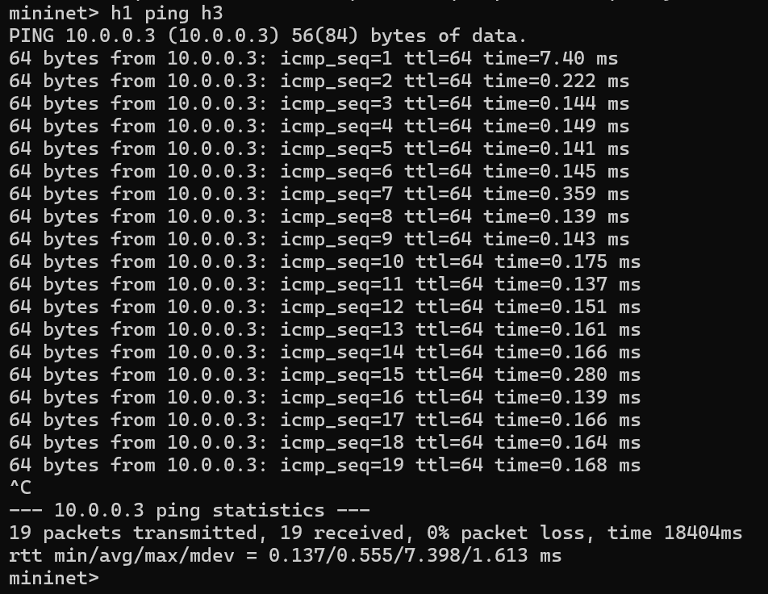

### Internet Bandwidth

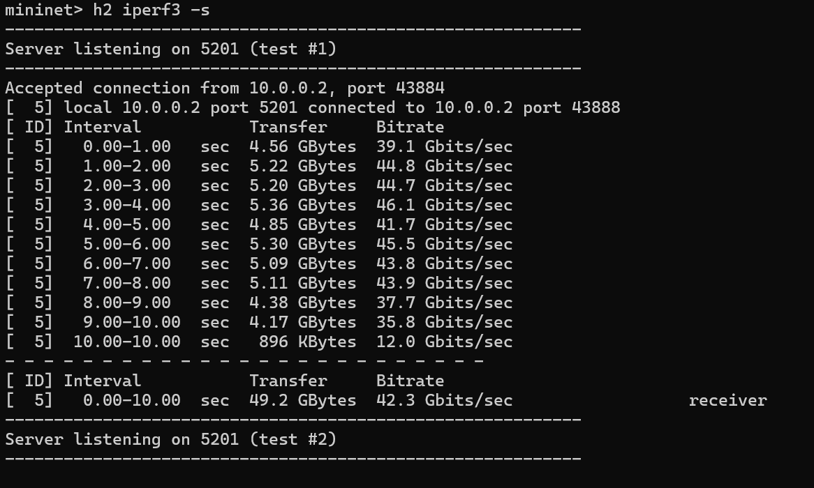
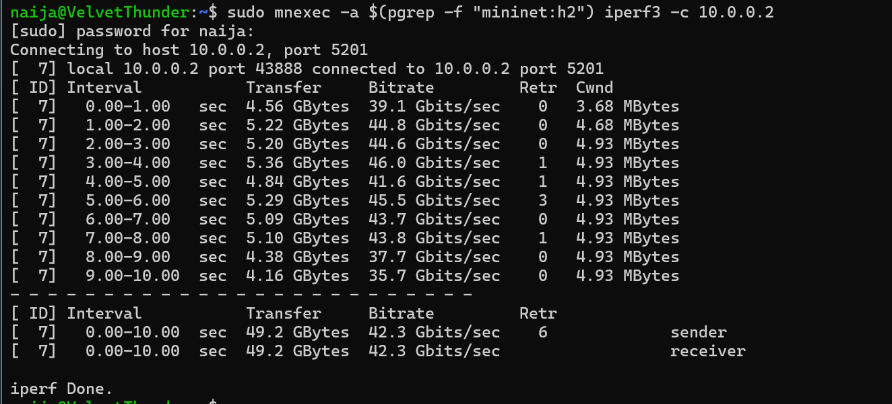
